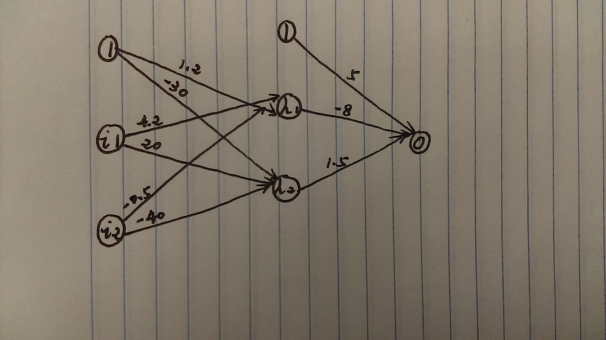

#Q1
#a


#b
$$h_1=tanh(1.2+4.2\times x_1-0.5\times x_2)$$

#c
$$z=tanh(5-8\times h_1+1.5\times h_2)$$

#d
$$z=tanh(5-8\times tanh(1.2+4.2\times x_1-0.5\times x_2)+1.5\times tanh(-30+20\times x1-40\times x_2))$$
tanh() is the activation function in this problem.

#Q2
```{r, eval=FALSE}
a 2-2-1 network with 9 weights
options were - linear output units 
 b->h1 i1->h1 i2->h1 
  0      5      0   
 b->h2 i1->h2 i2->h2 
  0      0      7 
  b->o  h1->o  h2->o 
  -5      4      6 
```
The original output gives us the following:
$$z=f(-5+4\times f(5\times x_1)+6\times f(7\times x_2))$$

```{r, eval=FALSE}
a 2-2-1 network with 9 weights
options were - linear output units 
 b->h1 i1->h1 i2->h1 
  0      0      7   
 b->h2 i1->h2 i2->h2 
  0      5     0 
  b->o  h1->o  h2->o 
  -5      6      4 
```
The above will give you the following:
$$z=f(-5+6\times f(7\times x_2)+4\times f(5\times x1))$$
Without knowing the exact type of the activation function, I can get the above set of weights to yield the same output. If the problem tells  us what kind of activation function used, I might get some other sets. The type of the activation function will affect how we treat the constant coefficients.

#Q3
#a
```{r}
#load data set
library(nnet)
set.seed(1234)
Advertising <- read.csv("Advertising.csv")
#using lm() & nnet()
fit.lm <- lm(Sales ~ TV + Radio + Newspaper, data = Advertising)
summary(fit.lm)
fit.nnet <- nnet(Sales ~ TV + Radio + Newspaper, size = 0, data = Advertising, skip = T, linout = T)
summary(fit.nnet)
#SSE for both models
anova(fit.lm)
sum(fit.nnet$residuals^2)
```
From the above, we can see that these two models are essentially the same. Their coefficients are almost the same and their SSEs are the same (556.8253). We know that an ANN without a hidden layer and with linear output is equivalent to a linear regression model.

#b
```{r}
#use scale function
Advert2 <- as.data.frame(scale(Advertising))
head(Advert2)
head(Advertising)
Advert2$Sales <- Advertising$Sales
head(Advert2)
```
From the above, variables are all changed as the result of the scale function. The values of those changed variables are shrunk to a smaller scale, roughly from -2 to 2. Finally, we changed back our Sales column.

#c
```{r}
#use nnet() and set seed to keep consistency
set.seed(1234)
fit.nnet_1 <- nnet(Sales ~ TV + Radio + Newspaper, size = 0, data = Advert2, skip = T, linout = T)
summary(fit.nnet_1)
#use lm() again
fit.lm_1 <- lm(Sales ~ TV + Radio + Newspaper, data = Advert2)
summary(fit.lm_1)
```
Because the Sales columns in both data frames are the same. Notice that "Then replace the changed __Sales__ column with the original one, since we do not want to change the responses." - from the assignment itself.    

#Q4
```{r}
#using code from HW4
#load data set and transform the training data into a df
load("mnist_all.RData")
mydf <- data.frame(train)
mytest <- data.frame(test)

#define a plot function for the training data
plot_digit <- function(j){
  arr784 <- as.numeric(train$x[j,])
  col=gray(12:1/12)
  image(matrix(arr784, nrow=28)[,28:1], col=col,
        main = paste("this is a ",train$y[j]))
}

#remove rows other than 4 and 7
myData <- mydf[mydf$y == 4 | mydf$y == 7,]
#print(myData$y)
```

#a
```{r, warning=FALSE, message=FALSE}
#from HW4, we already found 10 variables with the largest variances. For this problem, I choose two of them and test the correction
var(myData[,436])
var(myData[,352])
cor(myData[,436],myData[,352])

myfeatures_col_1 = c(436,352)
myDF <- myData[,c(myfeatures_col_1,786)]
myDF$labels = as.numeric(myData$y==4)

#logistic regression model
fit.lm_2 <- glm(labels ~ myDF[,1] + myDF[,2], data = myDF, family = binomial)
summary(fit.lm_2)
fit.lm_2.predict <- predict(fit.lm_2, type = "response")
table(myDF$labels, fit.lm_2.predict>0.5) 

#calculate AUC
library(pROC)
roc <- roc(myDF$labels,fit.lm_2.predict)
auc(roc)
```
We can see the AUC score is 0.7884.

#b
```{r, warning=FALSE, message=FALSE}
#create an ANN with one unit in the hidden layer
set.seed(1234)
library(nnet)
ann_fit_1 <- nnet(labels ~ myDF[,1] + myDF[,2], size = 1, data = myDF, skip = FALSE, linout = TRUE)
summary(ann_fit_1)

#calculate AUC
ann_fit_1.predict <- predict(ann_fit_1, type = "raw")
roc_1 <- roc(myDF$labels,ann_fit_1.predict)
auc(roc_1)
```
We can see the AUC score is 0.7784 which is slightly lower than the previous one. It means that a one-unit ANN is not doing better than a logistic regression model but close.

#c
```{r, warning=FALSE, message=FALSE}
#train three different ANNs with increased hidden units

#create an ANN with ten units in the hidden layer
set.seed(1234)
library(nnet)
ann_fit_10 <- nnet(labels ~ myDF[,1] + myDF[,2], size = 10, data = myDF, skip = FALSE, linout = TRUE)
#summary(ann_fit_10)
#calculate AUC
ann_fit_10.predict <- predict(ann_fit_10, type = "raw")
roc_10 <- roc(myDF$labels,ann_fit_10.predict)
auc(roc_10)

#create an ANN with one hundred units in the hidden layer
set.seed(1234)
library(nnet)
ann_fit_100 <- nnet(labels ~ myDF[,1] + myDF[,2], size = 100, data = myDF, skip = FALSE, linout = TRUE)
#summary(ann_fit_100)
#calculate AUC
ann_fit_100.predict <- predict(ann_fit_100, type = "raw")
roc_100 <- roc(myDF$labels,ann_fit_100.predict)
auc(roc_100)

#create an ANN with two hundred units in the hidden layer
set.seed(1234)
library(nnet)
ann_fit_200 <- nnet(labels ~ myDF[,1] + myDF[,2], size = 200, data = myDF, skip = FALSE, linout = TRUE)
#summary(ann_fit_200)
#calculate AUC
ann_fit_200.predict <- predict(ann_fit_200, type = "raw")
roc_200 <- roc(myDF$labels,ann_fit_200.predict)
auc(roc_200)
```
When the number of hidden units increases, the AUC score increases as well but doesn't improve a lot. We can see from the results above. It  might be overfitting since we are using 200 hundred hidden units and thus creating so many weights. They might be "too good" for our training data.


