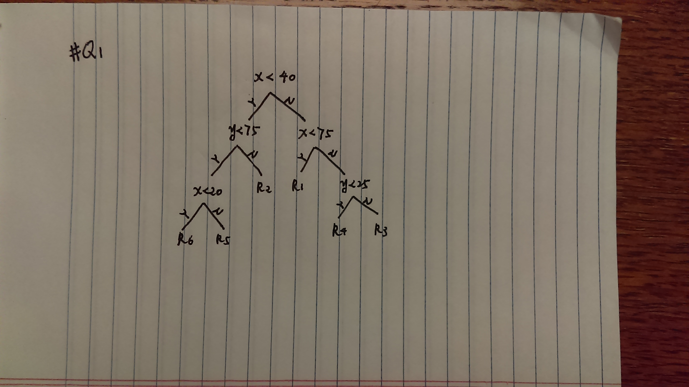

#Section 8.4
#Q1
```{r}
par(xpd = NA) #all plotting is clipped to the device region
plot(NA, NA, type = "n", xlim = c(0,100), ylim = c(0,100), xlab = "x", ylab = "y") #plot the frame
#plot lines and cutpoints
lines(x = c(40,40), y = c(0,100))
text(x = 40, y = 108, labels = c("t1"), col = "blue")
lines(x = c(0,40), y = c(75,75))
text(x = -8, y = 75, labels = c("t2"), col = "blue")
lines(x = c(75,75), y = c(0,100))
text(x = 75, y = 108, labels = c("t3"), col = "blue")
lines(x = c(20,20), y = c(0,75))
text(x = 20, y = 80, labels = c("t4"), col = "blue")
lines(x = c(75,100), y = c(25,25))
text(x = 70, y = 25, labels = c("t5"), col = "blue")
#add regions marks
text(x = (40+75)/2, y = 50, labels = c("R1"), col = "green")
text(x = 20, y = (100+75)/2, labels = c("R2"), col = "green")
text(x = (75+100)/2, y = (100+25)/2, labels = c("R3"), col = "green")
text(x = (75+100)/2, y = 25/2, labels = c("R4"), col = "green")
text(x = 30, y = 75/2, labels = c("R5"), col = "green")
text(x = 10, y = 75/2, labels = c("R6"), col = "green")
```


#Q4
#a


#b
```{r}
par(xpd = NA)
plot(NA, NA, type = "n", xlim = c(-2, 2), ylim = c(-3, 3), xlab = "X1", ylab = "X2")
lines(x = c(-2, 2), y = c(1, 1))
lines(x = c(1, 1), y = c(-3, 1))
text(x = (-2 + 1)/2, y = -1, labels = c(-1.8), col = "red")
text(x = 1.5, y = -1, labels = c(0.63), col = "red")
lines(x = c(-2, 2), y = c(2, 2))
text(x = 0, y = 2.5, labels = c(2.49), col = "red")
lines(x = c(0, 0), y = c(1, 2))
text(x = -1, y = 1.5, labels = c(-1.06), col = "red")
text(x = 1, y = 1.5, labels = c(0.21), col = "red")
```

#Q9
#a
```{r,warning=FALSE,message=FALSE}
library(ISLR)
data(OJ)
summary(OJ)
set.seed(1)
trainid <- sample(1:nrow(OJ), 800)
train <- OJ[trainid, ]
test <- OJ[-trainid, ]
```

#b
```{r,warning=FALSE,message=FALSE}
library(tree)
treefit <- tree(Purchase ~ ., data = train)
summary(treefit)
```
From the above, we can see that Number of terminal nodes is 8 and the training error rate is 0.165. Variables actually used in tree construction are "LoyalCH", "PriceDiff", "SpecialCH" and "ListPriceDiff".

#d
```{r}
plot(treefit)
text(treefit, pretty = 0)
```
From the graph, we realize that "LoyalCH" is the most important predictor in the tree model. The top 3 nodes (the top 2 levels) have "LoyalCH". (i)"LoyalCH"<0.264232 && (ii)0.508643>"LoyalCH">=0.264232 and "PriceDiff"<0.195 and "SpecialCH"<0.5 will give you MM but the other cases will give you CH.

#e
```{r}
treepred <- predict(treefit, test, type = "class")
table(treepred, test$Purchase)
```
```{r}
(12+49)/(147+62+12+49)
```
So the test error rate is 0.2259259.

#f
```{r}
cv.obj <- cv.tree(treefit, FUN = prune.misclass)
cv.obj
```

#g
```{r}
plot(cv.obj$size, cv.obj$dev, type = "b", xlab = "tree size", ylab = "cross-validated classification error rate")
```

#h
The tree size equal to 2, 5 and 8 correspond to the lowest cross-validated classification error rate and 2 is the smallest size of the tree with the lowest cross-validated classification error rate. 

#i
```{r}
prune_obj <- prune.misclass(treefit, best = 2)
plot(prune_obj)
text(prune_obj, pretty = 0)
```

#j
```{r}
summary(treefit)
summary(prune_obj)
```
The training error rates for pruned and unpruned trees are 0.1825 and 0.165. So the pruned one has a higher training error rate.  

#k
```{r}
prunepred <- predict(prune_obj, test, type = "class")
table(prunepred, test$Purchase)
```
```{r}
(40+30)/(119+81+30+40)
```
The test error rates for pruned and unpruned trees are 0.2592593 and 0.2259259. So the pruned one has a higher test error rate.

#Q12
```{r,warning=FALSE,message=FALSE}
#with the MNIST_6-8 data

#load data set and transform the training data into a df
load("mnist_all.RData")
#data splitting
traindf <- data.frame(train)
training <- sample(1:nrow(traindf), 0.7*nrow(traindf))
trained <- traindf[training, ]
tested <- traindf[-training, ]
mydf <- trained
mytestdf <- tested

#remove rows other than 6 and 8
myData <- mydf[mydf$y == 6 | mydf$y == 8,]
myData_1 <- mytestdf[mytestdf$y == 6 | mytestdf$y == 8,]
```

```{r,warning=FALSE,message=FALSE}
#pick a few dozen features
myfeatures_col_1 = c(408,436,380,464,463,353,352,381,491,435,
                     404,405,438,439,382,384,466,468,355,356,383,385,493,494,
                     276,277,256,258,232,233,291,292,166,168,170,171)

myDF <- myData[,c(myfeatures_col_1,786)]
myDF$labels = as.numeric(myData$y==6)
#myDF$labels

myDF_1 <- myData_1[,c(myfeatures_col_1,786)]
myDF_1$labels = as.numeric(myData_1$y==6)
#myDF_1$labels
```

```{r,warning=FALSE,message=FALSE}
#logistic regression model
fit.lm_2 <- glm(labels ~ myDF[,1] + myDF[,2] + myDF[,3] + myDF[,4] + myDF[,5] + myDF[,6] + myDF[,7] + myDF[,8] + myDF[,9] + myDF[,10] + myDF[,11] + myDF[,12] + myDF[,13] + myDF[,14] + myDF[,15] + myDF[,16] + myDF[,17] + myDF[,18] + myDF[,19] + myDF[,20] + myDF[,21] + myDF[,22] + myDF[,23] + myDF[,24] + myDF[,25] + myDF[,26] + myDF[,27] + myDF[,28] + myDF[,29] + myDF[,30] + myDF[,31] + myDF[,32] + myDF[,33] + myDF[,34] + myDF[,35] + myDF[,36], data = myDF, family = binomial)
summary(fit.lm_2)

fit.lm_2.predict <- predict(fit.lm_2, newdata = myDF_1, type = "response")
mean((fit.lm_2.predict-myDF_1$labels)^2)
```

```{r,warning=FALSE,message=FALSE}
#using random forest
library(randomForest)
set.seed(1)
fit.rf <- randomForest(labels ~ myDF[,1] + myDF[,2] + myDF[,3] + myDF[,4] + myDF[,5] + myDF[,6] + myDF[,7] + myDF[,8] + myDF[,9] + myDF[,10] + myDF[,11] + myDF[,12] + myDF[,13] + myDF[,14] + myDF[,15] + myDF[,16] + myDF[,17] + myDF[,18] + myDF[,19] + myDF[,20] + myDF[,21] + myDF[,22] + myDF[,23] + myDF[,24] + myDF[,25] + myDF[,26] + myDF[,27] + myDF[,28] + myDF[,29] + myDF[,30] + myDF[,31] + myDF[,32] + myDF[,33] + myDF[,34] + myDF[,35] + myDF[,36], data = myDF, mtry = 6)
fit.rf

fit.rf.predict <- predict(fit.rf, newdata = myDF)
mean((fit.rf.predict-myDF_1$labels)^2)
```

```{r,warning=FALSE,message=FALSE}
#using boosting
library(gbm)
set.seed(1)
fit.boost <- gbm(labels ~ myDF[,1] + myDF[,2] + myDF[,3] + myDF[,4] + myDF[,5] + myDF[,6] + myDF[,7] + myDF[,8] + myDF[,9] + myDF[,10] + myDF[,11] + myDF[,12] + myDF[,13] + myDF[,14] + myDF[,15] + myDF[,16] + myDF[,17] + myDF[,18] + myDF[,19] + myDF[,20] + myDF[,21] + myDF[,22] + myDF[,23] + myDF[,24] + myDF[,25] + myDF[,26] + myDF[,27] + myDF[,28] + myDF[,29] + myDF[,30] + myDF[,31] + myDF[,32] + myDF[,33] + myDF[,34] + myDF[,35] + myDF[,36], data = myDF, distribution = "gaussian", n.trees = 5000)
summary(fit.boost)

fit.boost.predict <- predict(fit.boost, newdata = myDF_1, n.trees = 5000)
mean((fit.boost.predict-myDF_1$labels)^2)
```
From the above, we can see that boosting gave the lowest test MSE and logistic regression is not the worst method.  


